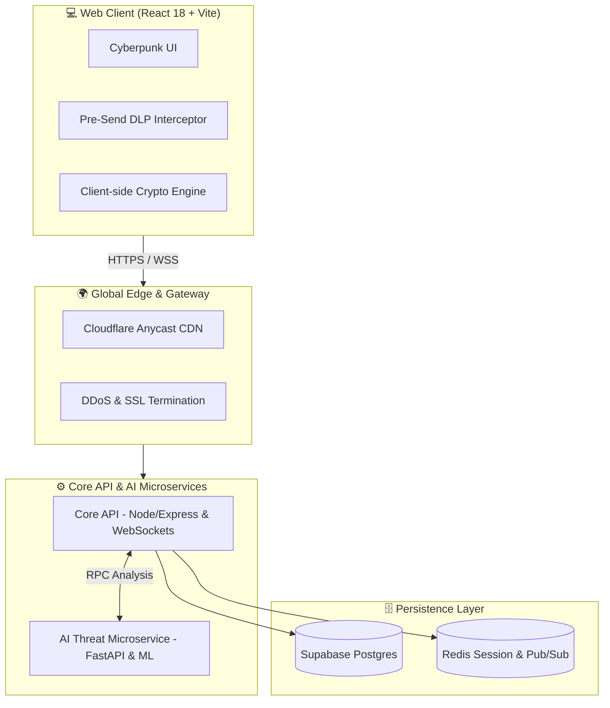

<div align="center">

  <!-- Animated Header Banner -->
  

  <p align="center">
    <a href="https://github.com"></a>
  </p>

  <!-- Live Badges -->
  <p align="center">
    
    
    
    
    
    
  </p>

  <p align="center">
    <a href="#-key-features"><b>Explore Features</b></a> •
    <a href="#-system-architecture"><b>Architecture</b></a> •
    <a href="#-quick-start"><b>Quick Start</b></a> •
    <a href="#-cognitive-threat-engine"><b>AI Intelligence</b></a> •
    <a href="#-cloud-deployment"><b>Deploy Worldwide</b></a>
  </p>

</div>

---

## ⚡ Overview

**SecureChat AI** is a next-generation, **Zero-Trust End-to-End Encrypted (E2EE)** communication suite that combines the **Signal Protocol (Double Ratchet + X3DH Key Exchange)** with a real-time **Cognitive Threat & DLP (Data Loss Prevention) Engine**.

Unlike traditional chat systems that only encrypt data in transit, SecureChat ensures cryptographic zero-knowledge at rest, prevents social engineering and psychological manipulation in real time, alerts senders before transmitting sensitive credentials/PII, and analyzes conversational contexts across English, Urdu, and Roman Urdu.

```
                  ┌─────────────────────────────────────────────────────────┐
                  │                 SECURECHAT CORE PILLARS                 │
                  ├───────────────────┬───────────────────┬─────────────────┤
                  │  🔒 Cryptography  │   🧠 AI Defense   │  ⚡ Performance │
                  │  Double Ratchet   │  Pre-Send DLP     │  WebSockets     │
                  │  Curve25519 Keys  │  Social Eng Guard │  Supabase DB    │
                  │  AES-256-GCM      │  Urdu/Roman ML    │  Redis Streams  │
                  └───────────────────┴───────────────────┴─────────────────┘
```

---

## 🛡️ Key Features

### 1. 🔐 Zero-Trust Cryptography & Signal Protocol
- **Signal Double Ratchet**: Continuous forward secrecy and break-in recovery with per-message ephemeral ratcheting.
- **X3DH Prekey Bundles**: Authenticated Diffie-Hellman key exchange (Identity, Signed PreKey, One-Time PreKeys).
- **Client-Side Cryptography**: Zero-knowledge encryption—the central server only routes encrypted binary ciphertexts.

### 2. 🧠 Multi-Modal Cognitive Threat Engine & Pre-Send DLP
- **Real-Time Pre-Send DLP Shield**: Intercepts passwords, OTPs, CNIC/SSN numbers, and private credentials before they leave the composer and warns the sender.
- **Multi-Lingual Threat Detection**: Deep neural classifiers trained on vast datasets for:
  - 🎣 Malicious URLs & credential harvesting
  - 🎭 Social engineering & psychological manipulation
  - 🇵🇰 **Urdu (اردو)** and **Roman Urdu** scam and fraud patterns
- **Context-Aware Conversational Analysis**: Evaluates entire chat trajectories to detect progressive manipulation.
- **Asymmetric Security Warnings**: Warns senders when sharing high-risk personal data without alerting malicious actors.

### 3. 📱 Permanent Identity & Strict ACID Guarantees
- **Phone-Only Immutable Identity**: Streamlined registration with phone number + password. Phone numbers act as immutable identity anchors.
- **Safe Block / Unblock**: Blocking restricts message dispatch, editing, and deletion while **preserving message history intact**.
- **Atomic Transactions**: All sensitive operations are guarded by `prisma.$transaction` with strict ACID consistency.

### 4. 🎨 Modern Cyberpunk UI & Full Responsiveness
- **Adaptive Layout**: Smooth multi-pane layout on desktop and single-pane navigation with back button support on mobile.
- **Micro-Animations & Visual Glows**: Security indicators (Green Safe, Orange Warning, Red Critical).
- **Cyberpunk Emoji Picker & Rich Attachments**.

---

## 🏛️ System Architecture



---

## 🚀 Quick Start (Local Development)

### Prerequisites
- **Node.js**: v20+
- **Python**: v3.11+
- **npm** or **pnpm**

### 1. Clone & Install Dependencies
```bash
git clone https://github.com/your-username/securechat.git
cd securechat

# Install npm monorepo workspaces
npm install

# Install AI service requirements
pip install -r apps/ai-service/requirements.txt
```

### 2. Configure Environment
```bash
cp .env.example .env
```

### 3. Run Microservices
```powershell
# Terminal 1: Start AI Threat Microservice (Port 8000)
cd apps/ai-service
python -m uvicorn src.main:app --host 0.0.0.0 --port 8000 --reload

# Terminal 2: Start Core API (Port 4000)
npm --prefix apps/api run dev

# Terminal 3: Start Web Frontend (Port 5173)
npm --prefix apps/web run dev
```

Open **`http://localhost:5173`** to access the client!

---

## 🐳 Docker Deployment

Run the entire isolated production stack (PostgreSQL, Redis, AI Service, API, and Nginx Web Client) with a single command:

```bash
docker compose -f docker-compose.prod.yml up -d --build
```

---

## ☁️ 1-Click Global Cloud Deployment

Deploy globally in **under 10 minutes** at zero cost using modern PaaS providers:

| Layer | Recommended Host | Deployment Guide |
|---|---|---|
| **Frontend** | **Vercel / Cloudflare Pages** | Import repo $\rightarrow$ Root: `apps/web` $\rightarrow$ Set `VITE_API_URL` & `VITE_WS_URL` |
| **API & AI Service** | **Render.com** | Deploy with 1-click using [`render.yaml`](render.yaml) blueprint |
| **Database** | **Supabase Postgres** | Provision free project on [supabase.com](https://supabase.com) |
| **Cache** | **Upstash Redis** | Serverless Redis instance on [upstash.com](https://upstash.com) |

---

## 🔒 Security Threat Matrix

| Threat Category | Mitigation Strategy | Engine Component |
|---|---|---|
| **Eavesdropping / Man-in-the-Middle** | Double Ratchet per-message ephemeral keys (Curve25519 + AES-GCM) | `packages/crypto` |
| **Credential Harvesting / Phishing** | URL heuristic parsing + ML classifier | `apps/ai-service/models/phishing` |
| **Social Engineering Attacks** | Temporal conversation context & sentiment manipulation analysis | `apps/ai-service/models/social_eng` |
| **Urdu / Roman Urdu Fraud** | Multilingual n-gram tokenization & regex rulebooks | `apps/ai-service/models/urdu` |
| **Data Leakage (PII / Passwords)** | Real-time client DLP interceptor before dispatch | `apps/web/DlpPreSendWarningModal` |
| **Account Takeover / Spam** | Immutable phone anchors & strict ACID transactions | `apps/api/routes/auth` |

---

## 👥 Authors & Acknowledgments

- **Lead Architecture & Development**: SecureChat Team
- **Built for**: Advanced Cyber Threat Defense & Privacy Engineering

<div align="center">
  <sub>Built with ❤️ for a safer, private, and encrypted internet.</sub>
</div>
